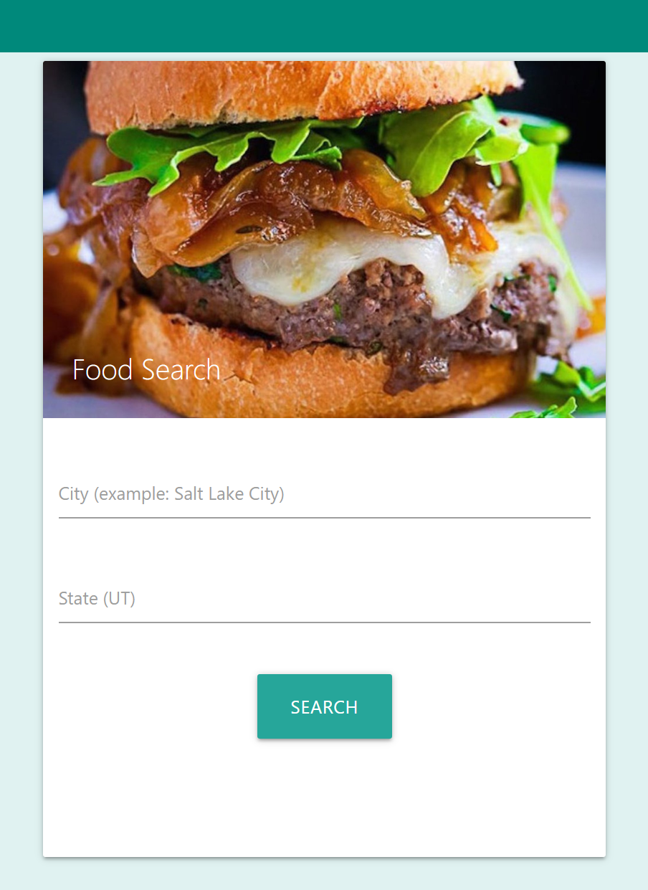
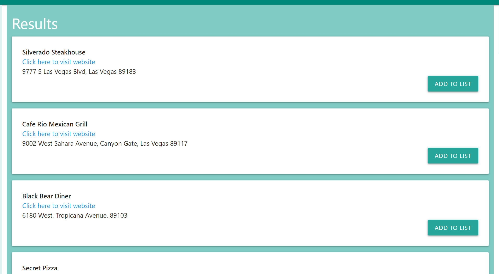
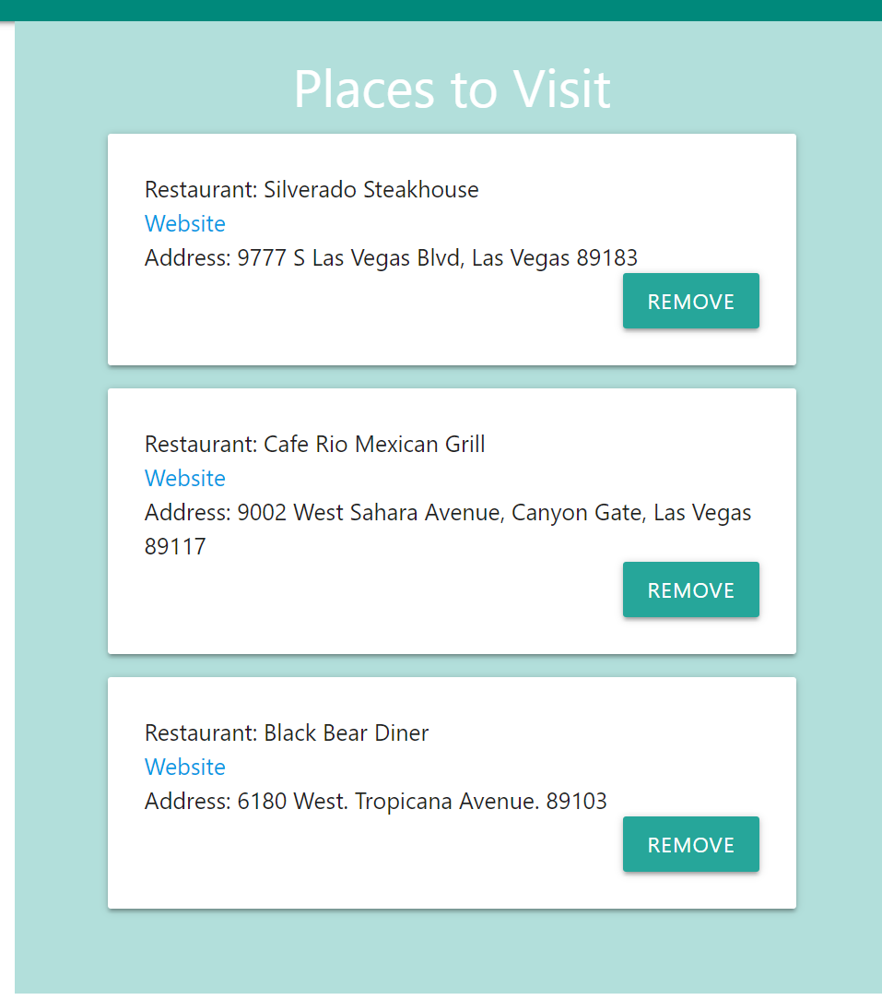

# Project1

**Deployed project link** https://trevorjburni.github.io/foodie-finder/

Foodie Finder is a website that allows the user to search food and breweries in a specific location. The user can add a restaurant or brewery to a list and have all their desired destinations in one place that is easily accessible. 

To get started with Foodie Finder, search for food or breweries on the left.

Once the search has been completed, your results will be shown in the center of the page under "Results".
This will show the address and website of the restaurant or brewery.
These results can be saved to a list on the right of the screen.

Below is displayed a list of saved search results, they can be removed from the list or be used as a reference of potential places that you want to visit.

# Technologies Used

- HTML
- CSS
- JavaScript
- Zomato, Mapquest and Open Brewery API's
- Materialize
- JQuery
- Firebase

# Contributors

- Trevor Burningham
- Stephen Green
- Kellie Hunsaker

# Future Features: 

1. Save your personalized list by signing into Google and share a link with your friends
2. Mobile app
